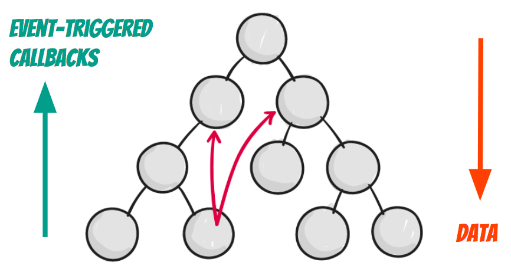
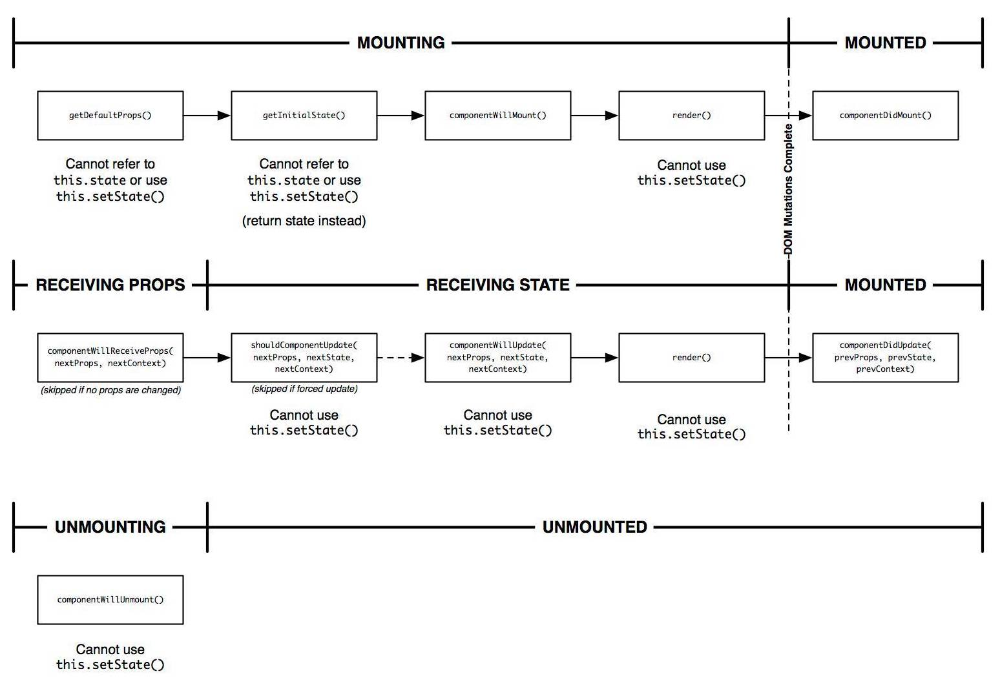

class: inverse, center, middle

# A React Primer

---

# Agenda

1. Passive vs Reactive programming
1. Unidirectional data flow
1. Virtual DOM and diffing algorithm
1. What is React, and what it's not
1. Components
1. Tooling
1. Hands-on Practice

---

class: inverse, center, middle

# Core Concepts

---

# Core Features

1. Virtual DOM
2. Componentised architecture
3. Unidirectional data-flow

---

# Why choose React

* Proven at scale
* Active OSS community
* Easy to learn
* Learn once, *write* anywhere

---

# Passive vs Reactive

* https://codepen.io/fede/pen/VMmQMY (VanillaJS)
* https://codepen.io/fede/pen/JrbpOQ (React)

---

# Declarative views

* make your code more predictable and easier to debug and test
* force you take your state out of the DOM

https://tylermcginnis.com/imperative-vs-declarative-programming/

---

# Unidirectional data flow

Data flows top-down, while actions (that cause mutations in data) are hoisted up. This concept becomes more prevalent with the introduction of a Flux-like framework like Redux.

---

# Unidirectional data flow (cont'd)

.full-width[]

---

# Unidirectional data flow (cont'd)

.center[.highlight[view = f(state)]]

* UI as a pure function of the state.
* Single source of truth

---

# We don't redraw our view on every state change 🙅‍♂️

Manipulating the DOM is expensive (think of huge apps).

???
The main problem is that DOM was never optimized for creating dynamic UI. Think about modern social networks like Twitter, Facebook or Instagram. After scrolling a little bit, the user will have tens of thousands of nodes. Interact with them efficiently is a huge problem. Try to move a 1000 divs 5 pixel left for example. It may take more than a second. It’s a lot of time for the modern web.

---

# Diffing algorithm

* Enter Virtual DOM, a low-cost abstraction of the HTML DOM, used to efficiently compute changes before rendering them.
* It’s kind of a lightweight copy of our DOM free of all of the heavy parts the real DOM is made of.

---

# Reconciliation

The reconciliation algorithm is an implementation detail. React could re-render the whole app on every action; the end result would be the same. We are regularly refining the heuristics in order to make common use cases faster.

---

# When to re-render? When state changes

1. **Dirty checking:** polling the data at a regular interval and check all of the values in the data structure recursively.
2. **Observable:** is to observe for the state change. If nothing has changed, we do nothing. If it changed, we know exactly what to update.

---

# How to re-render efficiently so that it’s fast

* Efficient diff algorithms
* Batching DOM read/write operations
* Efficient update of sub-tree only

---

class: inverse, center, middle

# Tooling

---

# [creact-react-app (CRA)](https://github.com/facebookincubator/create-react-app)

```
npm install -g create-react-app

create-react-app <project-name>
cd <project-name>
npm start
```

Then open http://localhost:3000/ to see your app.

When you’re ready to deploy to production, create a minified bundle with `npm run build`.

---

# Batteries included

* JSX, ES6+, and Flow support.
* A dev server
* Built-in linter with a reasonable ruleset.
* CSS, font and image files bundling.
* Autoprefixed CSS.
* Optimised production build w/sourcemaps.
* PWA ready w/an offline-first service worker and a web app manifest.

---

# What's inside?

* Webpack
* Babel
* ESLint
* Autoprefixer
* Jest

Also supports the following out of the box:

* Enzyme
* Flow
* Sass

---

class: center, middle

# Instagram Stories


---

class: inverse, center, middle

# Components are functions

---


```jsx
function Story() {
  return (
    <article className="Story">
      

      <aside>
        <span className="Story__name">purenewzealand</span>
        <span className="Story__date">6 hours ago</span>
      </aside>
    </article>
  );
}

ReactDOM.render(Story, document.getElementById('root'));
```

---

class: inverse, center, middle

# .lighten[Components are functions] that receive props

---


```jsx
function Story(props) {
  return (
    <article className="Story">
      

      <aside>
        <span className="Story__name">{props.username}</span>
        <span className="Story__date">{props.date}</span>
      </aside>
    </article>
  );
}

ReactDOM.render(Story, document.getElementById('root'));
```

---

class: inverse, center, middle

# Components can also be classes

---

```js
class Timer extends React.Component {
  // ...
  
  componentDidMount() {
    // called after the component is added to the DOM
    this.timerId = setInterval(this.tick, 1000);
  }

  componentWillUnmount() {
    // called before the component is removed from the DOM
    clearInterval(this.timerId);
  }

  tick() {
    this.setState({ date: moment() });
  }

  // ...
}
```

---

class: inverse, center, middle

# .lighten[Components can also be classes] that receive props

---

class: inverse, center, middle

# .lighten[Components can also be classes that receive props] and keep track of their own state

---

# Thinking in terms of UI components

Build encapsulated components that manage their own state, then compose them to make complex UIs. Since component logic is written in JavaScript instead of templates, you can easily pass rich data through your app and keep state out of the DOM.

---

class: inverse, center, middle

# Component lifecycle methods

---

.full-width[]

---

class: inverse, center, middle

# Hands-on Practice

## .lighten[Let's build an Instagram clone]

---

.full-width[]

---

## Mock data

https://api.myjson.com/bins/1eozi9

## Source code

https://github.com/fknussel/react-workshop

---

class: inverse, center, middle, thanks

## .lighten[Slides:] https://bit.ly/asd

## .lighten[Email:] fknussel@gmail.com

## .lighten[Twitter/GitHub:] @fknussel
