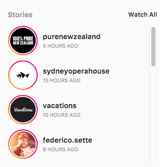

name: inverse-dark
layout: true
class: center, middle, inverse, inverse--dark
---
name: inverse-blue
layout: true
class: center, middle, inverse, inverse--blue
---
name: inverse-orange
layout: true
class: center, middle, inverse, inverse--orange
---
name: inverse-green
layout: true
class: center, middle, inverse, inverse--green
---

layout: false template: inverse-orange

# A React Primer

---

layout: false

# Agenda

1. Passive vs Reactive programming
1. Unidirectional data flow
1. Virtual DOM and diffing algorithm
1. What is React, and what it's not
1. Components
1. Tooling
1. Hands-on Practice

---

class: center, middle

# Instagram Stories



---

template: inverse-green

# Components are functions

---


```jsx
function Story() {
  return (
    <article className="Story">
      

      <aside>
        <span className="Story__name">purenewzealand</span>
        <span className="Story__date">6 hours ago</span>
      </aside>
    </article>
  );
}

ReactDOM.render(Story, document.getElementById('root'));
```

---

template: inverse-green

# .secondary[Components are functions] that receive props

---


```jsx
function Story(props) {
  return (
    <article className="Story">
      

      <aside>
        <span className="Story__name">{props.username}</span>
        <span className="Story__date">{props.date}</span>
      </aside>
    </article>
  );
}

ReactDOM.render(Story, document.getElementById('root'));
```

---

template: inverse-green

# Components can also be classes

---

template: inverse-green

# .secondary[Components can also be classes] that receive props

---

template: inverse-green

# .secondary[Components can also be classes that receive props] and keep track of their own state

---

template: inverse-blue

# Hands-on Practice

## .secondary[Let's build an Instagram clone]

---

## Let's build a super simple Instagram clone


---

## Mock data

https://api.myjson.com/bins/1eozi9

## Source code

https://github.com/fknussel/react-workshop

---

template: inverse-orange
class: thanks

## .lighten[Slides:] https://bit.ly/asd

## .lighten[Email:] fknussel@gmail.com

## .lighten[Twitter/GitHub:] @fknussel
